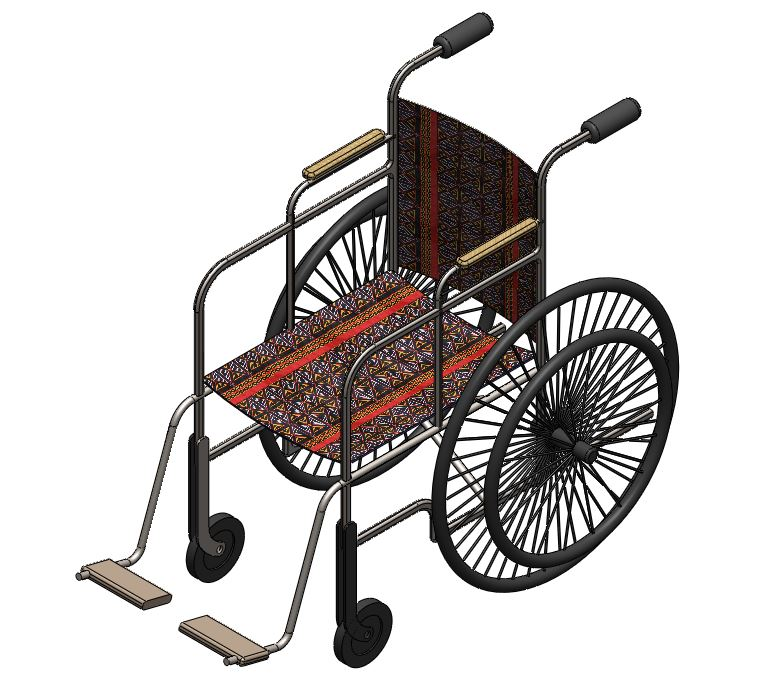
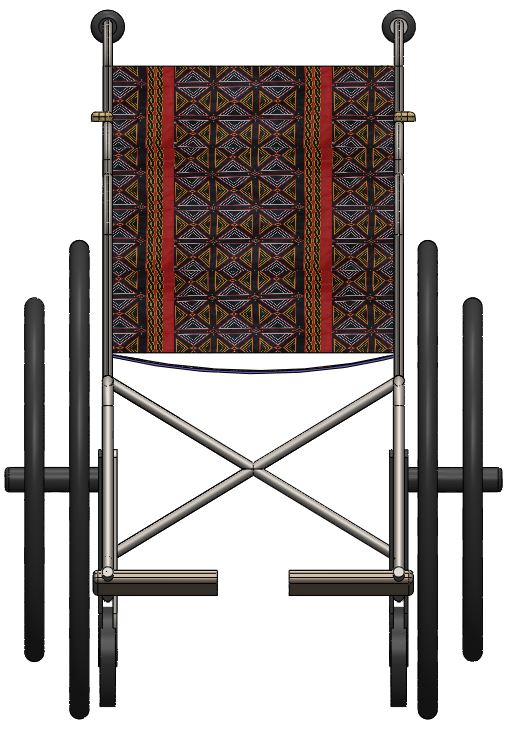
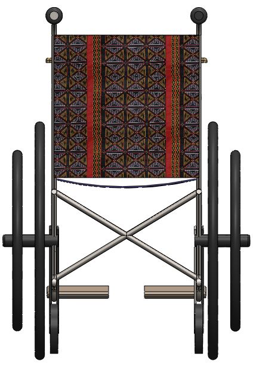
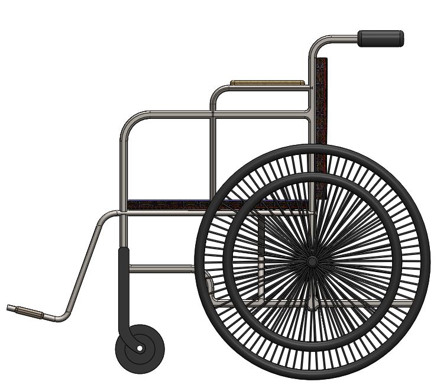
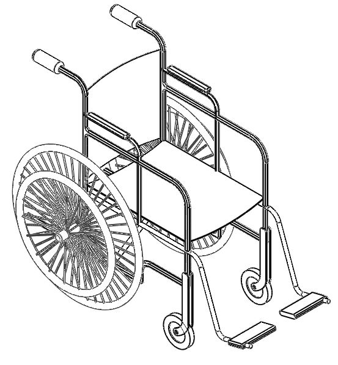

# Open 3D Wheel Chair Project
In most developing countries, owning a wheel chair for those in needs a can be a huge luxury that is difficult to imagine. Coming from a less developed country myself, I have seen many Physically challenged persons finding it hard to own a wheel chair. In countries like Cameroon where the average per capital income is less 200 Dollars, buying a wheel is not a priority even though the need is inevitable and the demand continuously increasing.

It is with this in mind that I am initiating this project, not just to facilitate the production process but also to make the design available for communities. The design is Open and anyone can contribute to the project.

This the Version 1.0 of the project. More updates information about the process of making a wheel chair following the open design will be provided in the nearest. All contributions to project are welcome.
The figure below shows the rendered image. All modeling was done in Solidworks.

Similar Open designs and Standard wheel chair designs were inspiration to the Open Wheel Chair Project.

## Isometric View

## [Click to view 3D model in real time](https://github.com/ebotbesong/Open-3D-Wheel-Chair-Project/blob/main/production%20files/git-hub.STL)

## Front View

## Back View

## Side view

## Wire Frame view

