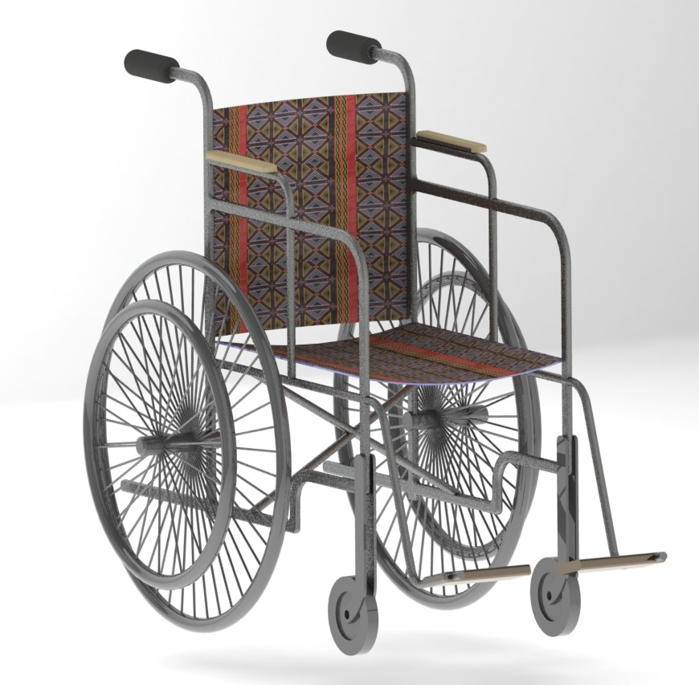

# Open 3D Wheel Chair Project
In most developing countries, owning a wheel chair for those in needs and physical challenge person can be a luxury. Many Physically challenge person find hard to own one. In countries like Cameroon where the average per capital income is less 250 Dollars for many people, buying a wheel is not a priority even though the need is inevitable for those in need.
It is with this in mind that I am initiating this project, not just to facilitate the production process but also to make the design available for communities. The design is Open and anyone can contribute to the project.

This the Version 1.0 of the project. More updates information about the process of making a wheel chair following the open design will be provided in the nearest. All contributions to project are welcome.
The figure below shows the rendered image. All modeling was done in Solidworks.

Similar Open designs and Standard wheel chair designs were inspiration to the Open Wheel Chair Project.

## Isometric View

## Front View

## Back View

## Side view

## Wire Frame view

